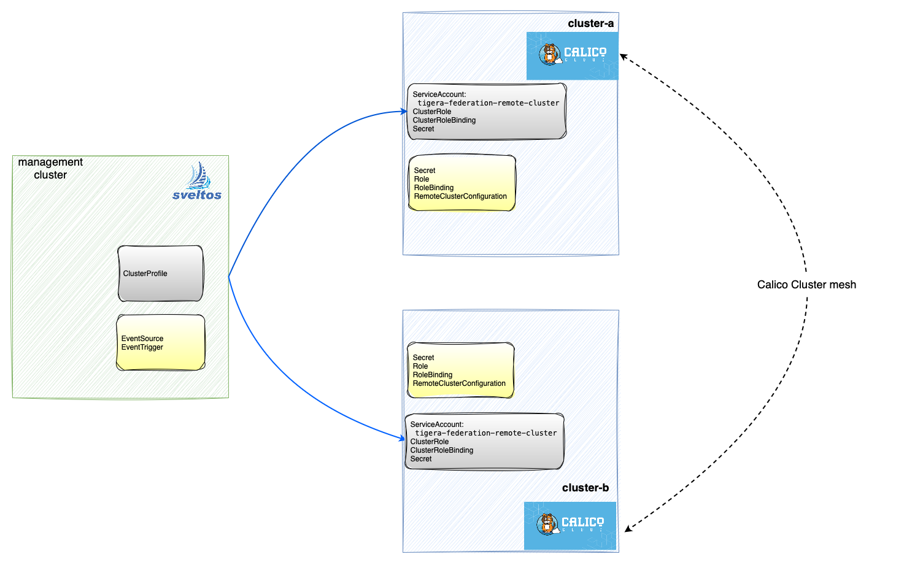
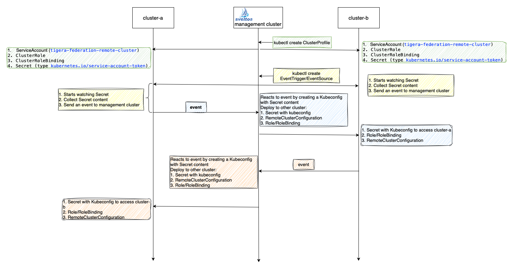

This shows how to establish cross-cluster connectivity with calico cloud with Sveltos.

Forget manually fetching resources!  This guide leverages Sveltos' event framework and templating to automate the process outlined in the [Calico documentation](https://docs.tigera.io/calico-cloud/multicluster/kubeconfig#remoteclusterconfiguration). 
We'll show you how to streamline deploying and fetching resources for a smoother experience.



To follow this demonstration, you'll need to have Calico Cloud deployed in two clusters (cluster-a and cluster-b).

## Step 1: Register Cluster with Sveltos

Register your Kubernetes clusters with Sveltos:

```
kubectl create ns demo
sveltosctl register cluster --namespace=demo --cluster=cluster-a --kubeconfig=cluster-a-kubeconfig --labels=id=cluster-a,cluster-federation=enabled
sveltosctl register cluster --namespace=demo --cluster=cluster-a --kubeconfig=cluster-b-kubeconfig --labels=id=cluster-b,cluster-federation=enabled
```

Verify your clusters were successfully registered:

```
kubectl get sveltoscluster -n demo
NAME       READY   VERSION
cluster-a   true    v1.29.2+k3s1
cluster-b   true    v1.28.7+k3s1
```

# Step 2: Prepare the management cluster

Create a ConfigMap per cluster containing:

- certificate authority data
- server IP:Port
- namespace

For instance

```yaml
apiVersion: v1
kind: ConfigMap
metadata:
  name: cluster-b
  namespace: demo
data:
  certauthdata: <CERTIFICATE AUTHORITY DATA>
  server: https://<IP>:<PORT>
  namespace: demo
```

## Step 3: Deploy ServiceAccount to Both Clusters



To enable authentication with remote clusters, we'll leverage a `ClusterProfile`. This profile will deploy several resources:

- ServiceAccount: This account (`tigera-federation-remote-cluster`) will be used by remote clusters to authenticate with other cluster.
- ClusterRole and ClusterRoleBinding: These resources define the permissions (RBAC) granted to the ServiceAccount, allowing it to perform specific actions within the cluster.
- Secret (type kubernetes.io/service-account-token): This secret stores the token associated with the ServiceAccount, which remote clusters will use for authentication.

```
kubectl apply -f https://raw.githubusercontent.com/projectsveltos/demos/main/calico-multi-cluster/federation-resources.yaml
kubectl apply -f https://raw.githubusercontent.com/projectsveltos/demos/main/calico-multi-cluster/deploy-fedeation-resources.yaml
```

Verify all resources are deployed:

```
sveltosctl show addons 
+----------------+----------------------------------------------+-------------+----------------------------------+---------+--------------------------------+--------------------------------------------+
|    CLUSTER     |                RESOURCE TYPE                 |  NAMESPACE  |               NAME               | VERSION |              TIME              |                  PROFILES                  |
+----------------+----------------------------------------------+-------------+----------------------------------+---------+--------------------------------+--------------------------------------------+
| demo/cluster-a | rbac.authorization.k8s.io:ClusterRoleBinding |             | tigera-federation-remote-cluster | N/A     | 2024-08-27 11:53:42 +0200 CEST | ClusterProfile/deploy-federation-resources |
| demo/cluster-a | :ServiceAccount                              | kube-system | tigera-federation-remote-cluster | N/A     | 2024-08-27 11:53:38 +0200 CEST | ClusterProfile/deploy-federation-resources |
| demo/cluster-a | :Secret                                      | kube-system | tigera-federation-remote-cluster | N/A     | 2024-08-27 11:53:39 +0200 CEST | ClusterProfile/deploy-federation-resources |
| demo/cluster-a | rbac.authorization.k8s.io:ClusterRole        |             | tigera-federation-remote-cluster | N/A     | 2024-08-27 11:53:41 +0200 CEST | ClusterProfile/deploy-federation-resources |
| demo/cluster-b | rbac.authorization.k8s.io:ClusterRole        |             | tigera-federation-remote-cluster | N/A     | 2024-08-27 11:53:38 +0200 CEST | ClusterProfile/deploy-federation-resources |
| demo/cluster-b | rbac.authorization.k8s.io:ClusterRoleBinding |             | tigera-federation-remote-cluster | N/A     | 2024-08-27 11:53:39 +0200 CEST | ClusterProfile/deploy-federation-resources |
| demo/cluster-b | :ServiceAccount                              | kube-system | tigera-federation-remote-cluster | N/A     | 2024-08-27 11:53:40 +0200 CEST | ClusterProfile/deploy-federation-resources |
| demo/cluster-b | :Secret                                      | kube-system | tigera-federation-remote-cluster | N/A     | 2024-08-27 11:53:41 +0200 CEST | ClusterProfile/deploy-federation-resources |
+----------------+----------------------------------------------+-------------+----------------------------------+---------+--------------------------------+--------------------------------------------+     
```

## Step 3: Create RemoteClusterConfigurations

Sveltos' event framework will retrieve the token linked to the `tigera-federation-remote-cluster` ServiceAccount previously deployed. 
This token will then be used by Sveltos' templating engine to generate a kubeconfig, which will be deployed.

```
kubectl apply -f https://raw.githubusercontent.com/projectsveltos/demos/main/calico-multi-cluster/event-configuration.yaml
```

Above deploys few resources in the management cluster. Lets deep dive on what those are.

### EventSource

An EventSource contains the definition of the event we are interested in. In this demo, the event is defined as any change to the Secret containing the ServiceAccount 
`tigera-federation-remote-cluster` token.

### EventTrigger

An EventTrigger instance specifies two key elements:

1. **Event Source**: References an EventSource instance to define the desired event and the clusters to monitor (`sourceClusterSelector`).
2. **Destination** : Specifies the Kubernetes resources to deploy in response to the event and their target cluster(s) (`destinationClusterSelector`).

Upon detecting an event, each EventTrigger will create a ConfigMap in the management cluster:

- cluster-a-token: Contains the ServiceAccount token from cluster A.
- cluster-b-token: Contains the ServiceAccount token from cluster B.

Additionally, each EventTrigger will generate a ClusterProfile:

- Cluster A to B: Uses the cluster A token to build a kubeconfig and deploy it as a Secret on cluster B.
- Cluster B to A: Uses the cluster B token to build a kubeconfig and deploy it as a Secret on cluster A.

### Recap

To achieve dynamic Kubeconfig deployment based on ServiceAccount creation events, the following steps are involved:

1. *Event Source Definition*: Define an EventSource to monitor for the creation of Secrets associated with the _tigera-federation-remote-cluster_ ServiceAccount. This ensures that the event framework is triggered only when relevant events occur.
2. *Token Retrieval and Resource Creation*: Upon detecting a qualifying event, the event framework retrieves the token associated with the newly created ServiceAccount. It then generates a resource within the management cluster to store this token (via `ConfigMapGenerators`).
3. *ClusterProfile Generation and References*: The EventTrigger is also configured to create a ClusterProfile in response to the event. This ClusterProfile references both the newly created resource containing the token and the existing ConfigMap with server IP:Port and certificate authority data (in its `TemplateResourceRefs` section).
4. *Resource Fetching and Kubeconfig Deployment*: The ClusterProfile dynamically fetches these referenced resources, extracts the required information, constructs the Kubeconfig, and deploys it to the managed cluster.