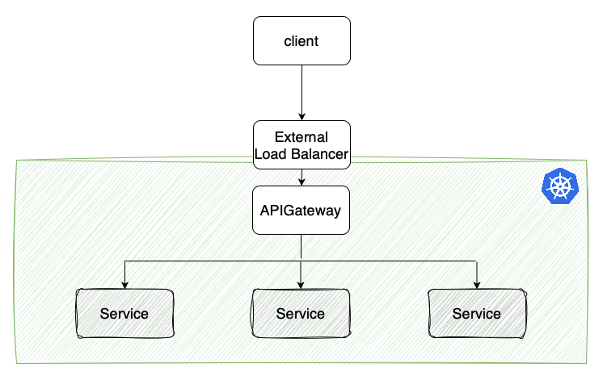
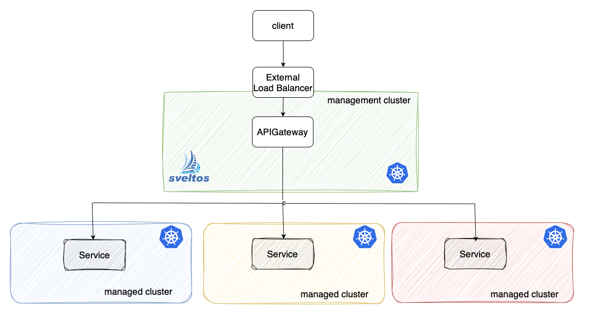
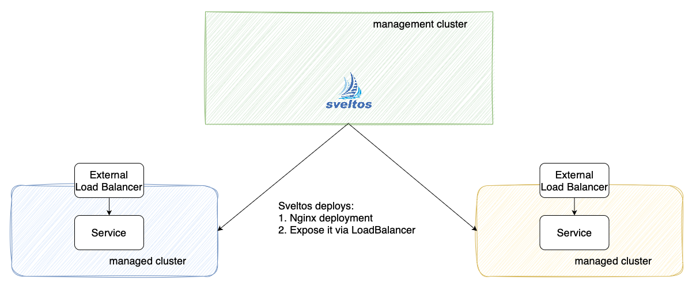
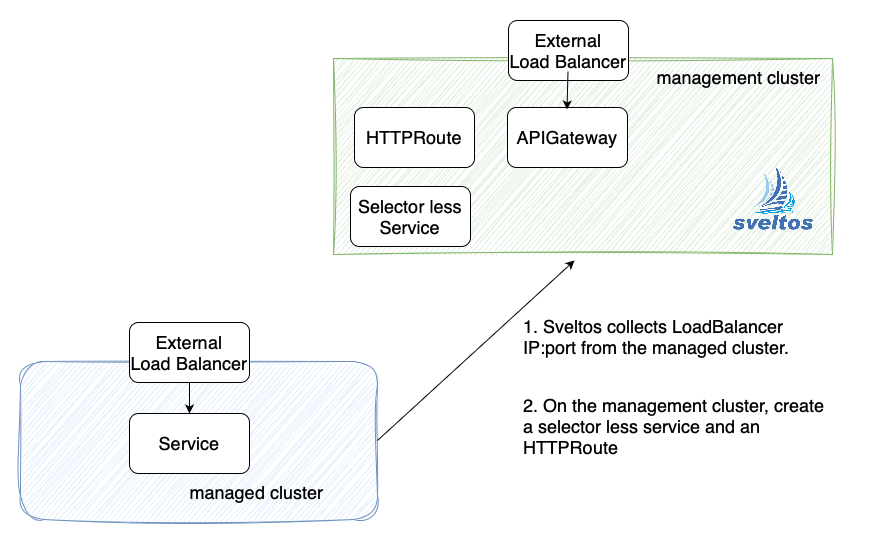
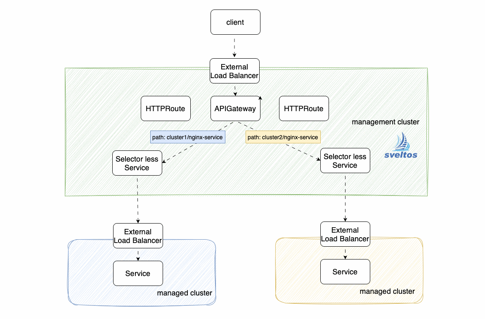

Kubernetes Services act as a stable access point for our microservices, abstracting away the complexity of managing multiple instances or their locations. Building on this, the Gateway API serves as a unified entry point for multiple Kubernetes Services.



Sveltos is a set of Kubernetes controllers that run in the management cluster. From the management cluster, Sveltos can manage add-ons and applications on a fleet of managed Kubernetes clusters. It is a declarative tool to ensure that the desired state of an application is always reflected in the actual state of the Kubernetes managed clusters.

This article demonstrates how Sveltos can deploy Kong as an API Gateway in the management cluster, subsequently deploy nginx services to two managed clusters, and finally leverage templating and event mechanisms to expose these services through the API Gateway.



## Lab Setup

A Civo cluster is used as management cluster. Then two extra Civo clusters, all with label env=fv:

```
+------------------------+-------------+-------------------------------------+
|    Cluster Name        |   Version   |             Comments                |
+------------------------+-------------+-------------------------------------+
|    cluster1            | v1.29.2+k3s1| Civo 3 Node - Medium Standard       |
|    cluster2            | v1.28.7+k3s1| Civo 3 Node - Medium Standard       |
+------------------------+-------------+-------------------------------------+
```

### Step 1: Install Sveltos on Managament Cluster
For this demonstration, we will install Sveltos in the management cluster. Sveltos installation details can be found [here](https://medium.com/r/?url=https%3A%2F%2Fprojectsveltos.github.io%2Fsveltos%2Fgetting_started%2Finstall%2Finstall%2F).

```
kubectl apply -f https://raw.githubusercontent.com/projectsveltos/sveltos/v0.35.0/manifest/manifest.yaml
kubectl apply -f https://raw.githubusercontent.com/projectsveltos/sveltos/v0.35.0/manifest/default-classifier.yaml
```

For this demo, Sveltos needs extra permissions.

```
kubectl edit clusterroles addon-controller-role-extra
```

and add following permissions

```yaml
- apiGroups:
  - ""
  resources:
  - services
  - endpoints
  verbs:
  - "*"
- apiGroups:
  - "gateway.networking.k8s.io"
  resources:
  - httproutes
  verbs:
  - "*"
```

### Step 2: Register Civo Cluster with Sveltos

Create two Kubernetes clusters using Civo UI. Download the Kubeconfigs, then:

```
kubectl create ns civo
sveltosctl register cluster --namespace=civo --cluster=cluster1 --kubeconfig=civo-cluster1-kubeconfig --labels=env=fv
sveltosctl register cluster --namespace=civo --cluster=cluster2 --kubeconfig=civo-cluster2-kubeconfig --labels=env=fv
```

Verify your Civo were successfully registered:

```
kubectl get sveltoscluster -n civo
NAME       READY   VERSION
cluster1   true    v1.29.2+k3s1
cluster2   true    v1.28.7+k3s1
```

### Step 3: Deploy Kong as API Gateway

`Sveltos` is used to deploy Kong as an API Gateway within the management cluster.

First, we label the management cluster with `type: mgmt`

```
kubectl label sveltoscluster -n mgmt mgmt type=mgmt
```

Next, we'll deploy the necessary Gateway API resources. This includes the core Custom Resource Definitions (CRDs), 
a GatewayClass to specify the API gateway implementation (Kong in this case), and a Gateway instance to represent the actual API gateway.

```
wget https://raw.githubusercontent.com/projectsveltos/demos/main/kong-apigateway/standard-install.yaml 
kubectl create configmap apigateway-crds --from-file=standard-install.yaml

wget https://raw.githubusercontent.com/projectsveltos/demos/main/kong-apigateway/gateway.yaml 
kubectl create configmap gateway --from-file=gateway.yaml

kubectl apply -f https://raw.githubusercontent.com/projectsveltos/demos/main/kong-apigateway/clusterprofile-apigateway.yaml
```

Finally we will deploy Kong Helm chart with Sveltos:

```
kubectl apply -f https://raw.githubusercontent.com/projectsveltos/demos/main/kong-apigateway/clusterprofile-kong.yaml
```

ClusterProfile configuration involves selecting the management cluster using clusterSelector and deploying the Kong Helm chart

```yaml
apiVersion: config.projectsveltos.io/v1beta1
kind: ClusterProfile
metadata:
  name: kong
spec:
  dependsOn:
  - apigateway 
  clusterSelector:
    matchLabels:
      type: mgmt
  helmCharts:
  - repositoryURL:    https://charts.konghq.com
    repositoryName:   kong
    chartName:        kong/ingress
    chartVersion:     0.13.1
    releaseName:      kong
    releaseNamespace: kong
    helmChartAction:  Install
```

Verify all resources are deployed:

```
sveltosctl show addons                                                                                                                         
+-----------+-----------------------------------------------+-----------+-------------------------------------------+---------+--------------------------------+---------------------------+
|  CLUSTER  |                 RESOURCE TYPE                 | NAMESPACE |                   NAME                    | VERSION |              TIME              |         PROFILES          |
+-----------+-----------------------------------------------+-----------+-------------------------------------------+---------+--------------------------------+---------------------------+
| mgmt/mgmt | helm chart                                    | kong      | kong                                      | 0.13.1  | 2024-08-08 10:15:33 +0200 CEST | ClusterProfile/kong       |
| mgmt/mgmt | apiextensions.k8s.io:CustomResourceDefinition |           | gatewayclasses.gateway.networking.k8s.io  | N/A     | 2024-08-08 10:15:08 +0200 CEST | ClusterProfile/apigateway |
| mgmt/mgmt | apiextensions.k8s.io:CustomResourceDefinition |           | gateways.gateway.networking.k8s.io        | N/A     | 2024-08-08 10:15:08 +0200 CEST | ClusterProfile/apigateway |
| mgmt/mgmt | apiextensions.k8s.io:CustomResourceDefinition |           | grpcroutes.gateway.networking.k8s.io      | N/A     | 2024-08-08 10:15:08 +0200 CEST | ClusterProfile/apigateway |
| mgmt/mgmt | apiextensions.k8s.io:CustomResourceDefinition |           | httproutes.gateway.networking.k8s.io      | N/A     | 2024-08-08 10:15:09 +0200 CEST | ClusterProfile/apigateway |
| mgmt/mgmt | apiextensions.k8s.io:CustomResourceDefinition |           | referencegrants.gateway.networking.k8s.io | N/A     | 2024-08-08 10:15:09 +0200 CEST | ClusterProfile/apigateway |
| mgmt/mgmt | gateway.networking.k8s.io:GatewayClass        |           | kong-class                                | N/A     | 2024-08-08 10:15:10 +0200 CEST | ClusterProfile/apigateway |
| mgmt/mgmt | gateway.networking.k8s.io:Gateway             | kong      | kong-gateway                              | N/A     | 2024-08-08 10:15:10 +0200 CEST | ClusterProfile/apigateway |
+-----------+-----------------------------------------------+-----------+-------------------------------------------+---------+--------------------------------+---------------------------+
```

### Step 4: Deploy Nginx services to both cluster



Sveltos deploys Nginx to each managed cluster, exposing it via a LoadBalancer Service accessible only from the management cluster.
Following creates a ConfigMap with nginx resources:

```
wget https://raw.githubusercontent.com/projectsveltos/demos/main/kong-apigateway/production-nginx.yaml
kubectl create configmap production-nginx --from-file=production-nginx.yaml
kubectl annotate configmap production-nginx projectsveltos.io/template=ok
```

Then use a ClusterProfile to deploy those resources to all managed clusters:

```
kubectl apply -f https://raw.githubusercontent.com/projectsveltos/demos/main/kong-apigateway/clusterprofile-production-nginx.yaml
```

ClusterProfile selects managed clusters labeled env: fv and deploys resources defined in a referenced ConfigMap. This ConfigMap contains template-based Deployment and Service definitions, which are instantiated using information from the kong-gateway-proxy Service within the kong namespace of the management cluster.

```yaml
apiVersion: config.projectsveltos.io/v1beta1
kind: ClusterProfile
metadata:
  name: production-nginx
spec:
  clusterSelector:
    matchLabels:      
      env: fv
  templateResourceRefs:
  - resource:
      apiVersion: v1
      kind: Service
      name: kong-gateway-proxy
      namespace: kong
    identifier: KongGatewayProxy
  policyRefs:
  - name: production-nginx
    namespace: default
    kind: ConfigMap
```

Verify that nginx is successfully deployed on managed clusters

```
sveltosctl show addons --namespace=civo
+---------------+-----------------+-----------+------------------+---------+--------------------------------+---------------------------------+
|    CLUSTER    |  RESOURCE TYPE  | NAMESPACE |       NAME       | VERSION |              TIME              |            PROFILES             |
+---------------+-----------------+-----------+------------------+---------+--------------------------------+---------------------------------+
| civo/cluster1 | :ConfigMap      | default   | nginx-config     | N/A     | 2024-08-07 17:38:42 +0200 CEST | ClusterProfile/production-nginx |
| civo/cluster1 | apps:Deployment | default   | nginx-deployment | N/A     | 2024-08-07 17:38:42 +0200 CEST | ClusterProfile/production-nginx |
| civo/cluster1 | :Service        | default   | nginx-service    | N/A     | 2024-08-07 17:38:42 +0200 CEST | ClusterProfile/production-nginx |
+---------------+-----------------+-----------+------------------+---------+--------------------------------+---------------------------------+
```

## Step 5: Configure HTTPRoute for each service



Sveltos simplifies access to the Nginx services running in your managed clusters. It achieves this by leveraging the Gateway API:

1. **Discovery**: Sveltos identifies the IP address and port of each LoadBalancer service sitting in front of Nginx instances within your managed clusters.
2. **Service Creation**: It creates a headless Service (without a cluster IP) in the management cluster. This Service represents the Nginx instance and references the discovered IP:port combination through an Endpoint resource.
3. **HTTPRoute Generation**: Finally, Sveltos creates an HTTPRoute object for each Nginx instance. This HTTPRoute defines how traffic reaches the Nginx service.

To achieve all of above just post:

```
kubectl apply -f https://raw.githubusercontent.com/projectsveltos/demos/main/kong-apigateway/fetch-production-nginx.yaml
```

Two HTTPRoutes instances were created by Sveltos on the management cluster:

```
kubectl get httproutes -A                
NAMESPACE   NAME                     HOSTNAMES        AGE
civo        cluster2-nginx-service   ["worlds.com"]   22s
civo        cluster1-nginx-service   ["worlds.com"]   12s
```

Looking at one of those HTTPRoute instances:

```yaml
apiVersion: gateway.networking.k8s.io/v1
kind: HTTPRoute
metadata:
  name: cluster1-nginx-service
  namespace: civo
spec:
  hostnames:
  - worlds.com
  parentRefs:
  - group: gateway.networking.k8s.io
    kind: Gateway
    name: kong-gateway
    namespace: kong
  rules:
  - backendRefs:
    - group: ""
      kind: Service
      name: cluster1-nginx-service
      port: 80
      weight: 1
    matches:
    - path:
        type: PathPrefix
        value: /cluster1/nginx-service
```

it has a rule that redirects requests to the path /cluster1/nginx-service. The rule points to a headless Service named cluster1-nginx-service on port 80. This Service acts as a bridge to the actual Nginx instance behind the LoadBalancer in your managed cluster.




## Step 6: Reach the Nginx services via Gateway API

Get the IP:port of the LoadBalancer service exposing the Gateway API

```
kubectl get services -n kong kong-gateway-proxy 
NAME                 TYPE           CLUSTER-IP      EXTERNAL-IP     PORT(S)                      AGE
kong-gateway-proxy   LoadBalancer   10.43.126.228   212.2.242.138   80:32155/TCP,443:31584/TCP   19m
```

verify both Nginx services can be reached via Gateway API:

```
curl -H "Host: worlds.com" http://212.2.242.138:80/cluster1/nginx-service 
<html>
<h2>Hello world. We are in cluster1 cluster!</h2>
</html>
```

```
curl -H "Host: worlds.com" http://212.2.242.138:80/cluster2/nginx-service
<html>
<h2>Hello world. We are in cluster2 cluster!</h2>
</html>
```

## Step 7: Add another managed cluster

When you register a new cluster (e.g., cluster3), Sveltos takes care of everything for you:

1. **Automatic Nginx Deployment**: Sveltos automatically deploys an Nginx instance within the new cluster (cluster3).
2. **Gateway API Integration**: It creates an HTTPRoute object to manage traffic routing for the new Nginx instance. 
3. **Seamless Service Access**: Clients can now access the Nginx service in cluster3 via Gateway API on the management cluster.

```
sveltosctl register cluster --namespace=civo --cluster=cluster3 --kubeconfig=civo-cluster3-kubeconfig --labels=env=fv
```

New HTTPRoute is created by Sveltos:

```
kubectl get httproutes -n civo                                                                                                                                   
NAME                     HOSTNAMES        AGE
cluster2-nginx-service   ["worlds.com"]   19m
cluster1-nginx-service   ["worlds.com"]   18m
cluster3-nginx-service   ["worlds.com"]   20s
```

And reaching the Nginx instance on cluster3

```
curl -H "Host: worlds.com" http://212.2.242.138:80/cluster3/nginx-service        
<html>
<h2>Hello world. We are in cluster3 cluster!</h2>
</html>
```