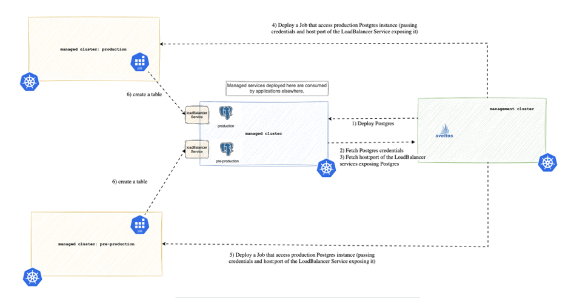

Created three Civo clusters and registered all of them to be managed by Sveltos:

1. SveltosCluster managed-services/managed-service-cluster was used to deploy Postgres
2. SveltosCluster project-a/pre-production  and project-a/production were used to deploy applications that access the managed Postgres
3. SveltosCluster mgmt/mgmt is the management cluster where Sveltos is running

```
kubectl get sveltoscluster -A --show-labels                                     
NAMESPACE          NAME                      READY   VERSION        LABELS
managed-services   managed-service-cluster   true    v1.29.2+k3s1   projectsveltos.io/k8s-version=v1.29.2,sveltos-agent=present,type=managed-services
project-a          pre-production            true    v1.29.2+k3s1   projectsveltos.io/k8s-version=v1.29.2,sveltos-agent=present,type=pre-production
project-a          production                true    v1.29.2+k3s1   projectsveltos.io/k8s-version=v1.29.2,sveltos-agent=present,type=production
mgmt               mgmt                      true    v1.30.0        projectsveltos.io/k8s-version=v1.30.0,sveltos-agent=present
```

Please note the labels:

- type: managed-services for the cluster where services are deployed
- type: pre-production for the cluster where applications will reach the pre-production Postgres instance
- type: production for the cluster where applications will reach the production Postgres instance

For this demo, Sveltos needs extra permissions

```
kubectl edit clusterroles  addon-controller-role-extra
```

and add following permissions

```
- apiGroups:
  - ""
  resources:
  - configmaps
  - namespaces 
  - secrets
  verbs:
  - "*"
```


The file [production-postgres.yaml](production-postgres.yaml) contains Kubernetes resources to deploy Postgres (with password __my-production-password__) in the `production-services` namespace.

The file [pre-production-postgres.yaml](pre-production-postgres.yaml) contains Kubernetes resources to deploy Postgres (with password __my-pre-production-password__) in the `pre-production-services` namespace.

Create two ConfigMaps with the content of such files:

```
wget https://raw.githubusercontent.com/projectsveltos/demos/main/managed-services/production-postgres.yaml 
kubectl create configmap production-postgres --from-file=production-postgres.yaml
wget https://raw.githubusercontent.com/projectsveltos/demos/main/managed-services/pre-production-postgres.yaml 
kubectl create configmap pre-production-postgres --from-file=pre-production-postgres.yaml 
```

The file [deploy-postgres-clusterprofile](deploy-postgres-clusterprofile.yaml) contains Sveltos ClusterProfile to deploy on the `managed-services/managed-service-cluster`:

- postgres in the production-services namespace
- postgres in the pre-production-services namespace

(so we have two Postgres instances one used for production and one for pre-production).

```
kubectl apply -f https://raw.githubusercontent.com/projectsveltos/demos/main/managed-services/deploy-postgres-clusterprofile.yaml
```

We can verify Postgres is deployed using sveltosctl:

```
sveltosctl show addons
+------------------------------------------+-----------------+-------------------------+-------------------------+---------+--------------------------------+-----------------------------------------------+
|                 CLUSTER                  |  RESOURCE TYPE  |        NAMESPACE        |          NAME           | VERSION |              TIME              |                   PROFILES                    |
+------------------------------------------+-----------------+-------------------------+-------------------------+---------+--------------------------------+-----------------------------------------------+
| managed-services/managed-service-cluster | :Secret         | pre-production-services | postgres-secret         | N/A     | 2024-07-29 14:20:20 +0200 CEST | ClusterProfile/deploy-pre-production-postgres |
| managed-services/managed-service-cluster | apps:Deployment | pre-production-services | postgresql              | N/A     | 2024-07-29 14:20:21 +0200 CEST | ClusterProfile/deploy-pre-production-postgres |
| managed-services/managed-service-cluster | :Service        | pre-production-services | postgresql              | N/A     | 2024-07-29 14:20:22 +0200 CEST | ClusterProfile/deploy-pre-production-postgres |
| managed-services/managed-service-cluster | :Namespace      |                         | production-services     | N/A     | 2024-07-29 14:20:04 +0200 CEST | ClusterProfile/deploy-production-postgres     |
| managed-services/managed-service-cluster | :Secret         | production-services     | postgres-secret         | N/A     | 2024-07-29 14:20:06 +0200 CEST | ClusterProfile/deploy-production-postgres     |
| managed-services/managed-service-cluster | apps:Deployment | production-services     | postgresql              | N/A     | 2024-07-29 14:20:07 +0200 CEST | ClusterProfile/deploy-production-postgres     |
| managed-services/managed-service-cluster | :Service        | production-services     | postgresql              | N/A     | 2024-07-29 14:20:08 +0200 CEST | ClusterProfile/deploy-production-postgres     |
| managed-services/managed-service-cluster | :Namespace      |                         | pre-production-services | N/A     | 2024-07-29 14:20:18 +0200 CEST | ClusterProfile/deploy-pre-production-postgres |
+------------------------------------------+-----------------+-------------------------+-------------------------+---------+--------------------------------+-----------------------------------------------+
```



Once Postgres is deployed we need following information:

1. credentials (to connect to Postgres)
2. the ip:port of the LoadBalancer Kubernetes Service which is exposing Postgres

Sveltos event framework was used to collect such information.

The file [fetch-credentials](fetch-credentials.yaml) get the admin passwords from the Secrets on the managed-services-clusters.
The file [fetch-service-ip](fetch-service-ip.yaml) get the ip:Port from the LoadBalancer Services on the managed-services-clusters exposing Postgres production and pre-production.

```
kubectl apply -f https://raw.githubusercontent.com/projectsveltos/demos/main/managed-services/fetch-credentials.yaml
kubectl apply -f https://raw.githubusercontent.com/projectsveltos/demos/main/managed-services/fetch-service-ip.yaml
``` 

Verify that information was successfully collected

```
kubectl get configmap -n production-services postgres-host-port 
kubectl get configmap -n pre-production-services postgres-host-port
kubectl get secret -n production-services postgres-credentials
kubectl get secret -n pre-production-services postgres-credentials
```

At this point we are ready to deploy a Job in teh managed `production` cluster that creates a table on the production Postgres service running on the managed-services-clusters.

Let's create first a ConfigMap that contains a templatize Job.

```
kubectl apply -f https://raw.githubusercontent.com/projectsveltos/demos/main/managed-services/configmap-with-templated-job.yaml
```

and then ask Sveltos to:

- instantiate the Job
- deploy it to the production cluster

```
kubectl apply -f https://raw.githubusercontent.com/projectsveltos/demos/main/managed-services/deploy-job-to-production.yaml
```

With kubectl pointing to the production cluster we can verify the Job was created and successfully completed (a table was created in the Postgres on the clusters were services are deployed)

```
KUBECONFIG=<production-kubeconfig> kubectl get jobs -A
todo        todo-table                     1/1           3s         11s
```

We can deploy same Job to pre-production cluster. 

```
kubectl apply -f https://raw.githubusercontent.com/projectsveltos/demos/main/managed-services/deploy-job-to-pre-production.yaml

```

With kubectl pointing to the pre-production cluster we can verify the Job was created and successfully completed (a table was created in the Postgres on the clusters were services are deployed)

```
KUBECONFIG=<pre-production-kubeconfig> kubectl get jobs -A
NAMESPACE   NAME                           COMPLETIONS   DURATION   AGE
default     install-traefik2-nodeport-pr   1/1           9s         88m
todo        todo-table                     1/1           3s         6s
```
