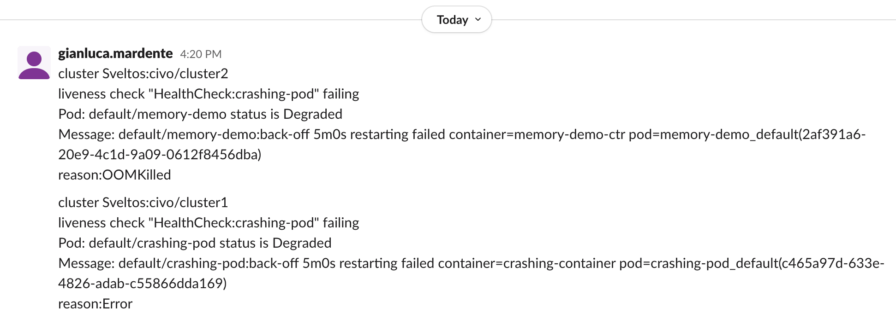

## Environment

### Creating a Management Cluster

To create a management cluster using Kind and the latest version of Projectsveltos, follow these steps:

```
git clone https://github.com/projectsveltos/addon-controller
cd addon-controller
make quickstart
```

This will create a management cluster using __Kind__ and installs latest version of __Projectsvelts__

### Registering Civo Clusters

[Civo](https://www.civo.com) was used to create managed cluster:

1. create clusters using Civo UI
2. download Kubeconfig of each Civo cloud
3. use sveltosctl to register Civo clusters to be managed by Projectsveltos
```
sveltosctl/bin/sveltosctl register cluster --namespace=civo --cluster=cluster1 --kubeconfig=<Path to CIVO Cluster Kubeconfig>
```

### Verifying Registration
To verify that the Civo clusters have been registered with Projectsveltos, run the following command:

```
kubectl get sveltosclusters -A
```

This will display a list of registered clusters, including their namespace, name, readiness status, and version. In our case:


```
kubectl get sveltosclusters -A
NAMESPACE   NAME       READY   VERSION
civo        cluster1   true    v1.26.4+k3s1
civo        cluster2   true    v1.27.1+k3s1
civo        cluster3   true    v1.28.2+k3s1
```

Edit each of the SveltosCluster instance by adding the label `env: fv`

## Configure Projectsveltos to detect crashing pods

Projectsveltos can be configured to monitor managed clusters and report events, such as pods entering a crashloopbackoff state. 
In this case, we want to instruct Projectsveltos to detect crashing pods and send a __Slack__ notification when one is found.

### HealthCheck and ClusterHealthCheck CustomResourceDefinition

The HealthCheck CRD is a mechanism for instructing Projectsveltos what to monitor.

Define a __HealthCheck__ instance with a Lua function. Following will instruct Projectsveltos to:

1. watch for Pods
2. consider only Pods in CrashLoopBackOff

```yaml
apiVersion: lib.projectsveltos.io/v1alpha1
kind: HealthCheck
metadata:
 name: crashing-pod
spec:
 group: ""
 version: v1
 kind: Pod
 script: |
   function evaluate()
     hs = {}
     hs.status = "Healthy"
     hs.ignore = true
     if obj.status.containerStatuses then
        local containerStatuses = obj.status.containerStatuses
        for _, containerStatus in ipairs(containerStatuses) do
          if containerStatus.state.waiting and containerStatus.state.waiting.reason == "CrashLoopBackOff" then
            hs.status = "Degraded"
            hs.ignore = false
            hs.message = obj.metadata.namespace .. "/" .. obj.metadata.name .. ":" .. containerStatus.state.waiting.message
            if containerStatus.lastState.terminated and containerStatus.lastState.terminated.reason then
              hs.message = hs.message .. "\nreason:" .. containerStatus.lastState.terminated.reason
            end
          end
```

A __ClusterHealthCheck__ instance references a __HealthCheck__ and selects a subset of managed clusters where Projectsveltos will monitor for events. It also tells Projectsveltos what type of notifications to send.

Define a __ClusterHealthCheck__ instance:

```yaml
apiVersion: lib.projectsveltos.io/v1alpha1
kind: ClusterHealthCheck
metadata:
 name: crashing-pod
spec:
 clusterSelector: env=fv
 livenessChecks:
 - name: crashing-pod
   type: HealthCheck
   livenessSourceRef:
     kind: HealthCheck
     apiVersion: lib.projectsveltos.io/v1alpha1
     name: crashing-pod
 notifications:
 - name: slack
   type: Slack
   notificationRef:
     apiVersion: v1
     kind: Secret
     name: slack
     namespace: default
```

Secret default/slack can be created with following command:

```
kubectl create secret generic slack --from-literal=SLACK_TOKEN=<YOUR SLACK TOKEN> --from-literal=SLACK_CHANNEL_ID=<YOUR SLACK CHANNEL> --type=addons.projectsveltos.io/cluster-profile 
```

This configuration will instruct Projectsveltos to watch for Pods in the __CrashLoopBackOff__ state in managed clusters with the label `env=fv`. If a crashing Pod is detected, Projectsveltos will send a __Slack__ notification using the slack secret.

## Create Pods

Create following Pod in one of your managed cluster. 

```yaml
apiVersion: v1
kind: Pod
metadata:
  name: crashing-pod
spec:
  containers:
  - name: crashing-container
    image: busybox
    command: ["/bin/sh", "-c", "while true; do echo 'Hello, world!'; sleep 1; done"]
    livenessProbe:
      initialDelaySeconds: 5
      periodSeconds: 2
      httpGet:
        port: 80
        path: /healthz
```

This Pod has a livenessProbe but it does not listen to port 80. So its livenessCheck will fail and the Pod will be restarted and end up in crashloopbackoff state.

Create this Pod in one of your managed cluster

```yaml
apiVersion: v1
kind: Pod
metadata:
  name: memory-demo
  namespace: default
spec:
  containers:
    - name: memory-demo-ctr
      image: polinux/stress
      resources:
        requests:
          memory: 100Mi
        limits:
          memory: 200Mi
      command: ["stress"]
      args: ["--vm", "1", "--vm-bytes", "250M", "--vm-hang", "1"]
```

This Pod will keep going in out of memory.

## Notifications

Projectsveltos will start watching for Pod events in the managed clusters. When above pods go in crashloopbackoff state, Projectsveltos will send a __Slack__ notification:



## Displaying information

Information on which pods are in a crashloopbackoff state, can be seen from the management cluster simply using __sveltosctl__:

```
./sveltosctl show resources 
+---------------+---------------+-------------+---------------------------+---------------------------------------------------------------------------------+
|    CLUSTER    |      GVK      |  NAMESPACE  |           NAME            |                                     MESSAGE                                     |
+---------------+---------------+-------------+---------------------------+---------------------------------------------------------------------------------+
| civo/cluster1 | /v1, Kind=Pod | default     | crashing-pod              | default/crashing-pod:back-off 1m20s                                             |
|               |               |             |                           | restarting failed container=crashing-container                                  |
|               |               |             |                           | pod=crashing-pod_default(edf107d9-8ebf-4334-a136-9d17fb9fb9ad)                  |
|               |               |             |                           | reason:Error                                                                    |
| civo/cluster2 |               | default     | memory-demo               | default/memory-demo:back-off 2m40s                                              |
|               |               |             |                           | restarting failed container=memory-demo-ctr                                     |
|               |               |             |                           | pod=memory-demo_default(a4858e65-2559-4cb3-8ecf-d5a860d63b2d)                   |
|               |               |             |                           | reason:OOMKilled                                                                |
+---------------+---------------+-------------+---------------------------+---------------------------------------------------------------------------------+
```


